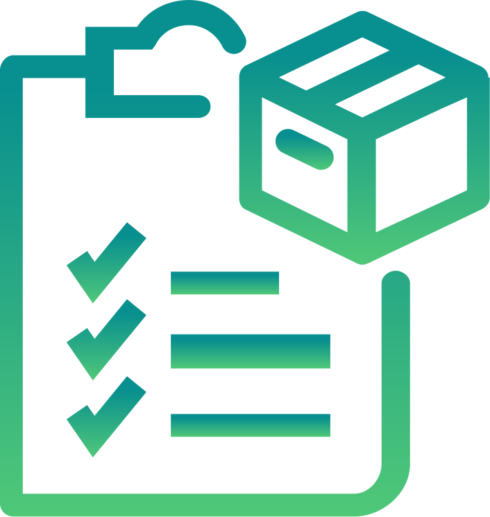

<h1 align="center" style="color: red">
  (O)TP (VA)ULT - ova. 
</h1>

> <code>ova</code> is a simple CLI tool which lets you manage your TOTPs, or basically lets you get your two-way authentication code straight to your clipboard.

# Available commands

| Command | Options | Description |
| --- | --- | --- |
| ova get | -n, --name `<name of a key>` | Get 2FA code for specified key |
| ova add | -n, --name `<name of a key>`, -k, --key `<2FA secret>` | Store your key locally at `~/.config/ova.store` |
| ova remove | -n, --name `<name of a key>` | Remove key from local store file |
| ova update | -n, --name `<name of a key>`, -k, --key `<new secret value>` | Update key if it exists |
| ova list | no options | List all stored keys and their secrets |
| ova help | no options | Provide description for all the commands |
  
Note that `ova help` could be executed per subcommand as well, like `ova add help` which provides a description for chosen subcommand.

# Install

You can install `ova` via

`cargo install ova`

Or use precompiled binaries provided as releases.

# Currently tested with

- [x] Bitwarden
- [x] Facebook
- [ ] Twitter

# What's to do

- [x] Storing keys in a local file :tada:
- [x] Fully working `get`, `add`, `list` commands :tada:
- [ ] Fully working `remove` and `update` commands
- [ ] Copy to clipboard working on Windows, Mac OS and Linux
- [ ] Pretty print
- [ ] More to come...

# Credits

Icon by [BomSymbols](https://thenounproject.com/korawan_m/)
